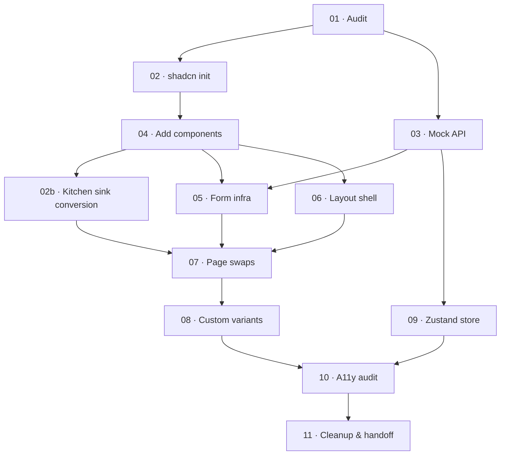

# Task List — Prototype → shadcn/ui Conversion

## Batac City DMS Frontend

**Scope:** Convert the `batac-dms-frontend` prototype from plain Tailwind to shadcn/ui components, while introducing a typed mock backend layer that will be replaced 1-for-1 by real tRPC calls when the server is ready.

**Ground rules for all tasks:**

- Stack: Vite + React (SPA), TypeScript, Tailwind CSS v3, shadcn/ui, TanStack Query, Zustand, React Hook Form + Zod, date-fns.
- Do **not** install the real backend client yet. All server calls go through a mock layer (see Task 03).
- Do **not** add SSR, routing frameworks other than React Router, or any cloud-vendor-specific SDK.
- All component files live in `src/components/ui/` (shadcn-generated) or `src/components/` (app-level). No logic in `pages/`; pages are thin composition files only.
- Follow the docs in `docs/design/` for brand, accessibility, and component guidelines.

---

## TASK 01 — Codebase audit & token extraction

**Goal:** Produce a written inventory that becomes the input for every subsequent task. No code changes in this task.

### Instructions

1. Read all files in `docs/design/` in full. Extract:
    
    - The official brand color palette (hex values and their named roles).
    - The defined type scale (font families, sizes, weights).
    - The border-radius scale.
    - Any named shadow or elevation values.
    - Accessibility requirements (contrast ratios, focus ring spec).
2. Scan the entire `src/` tree with:
    
    ```bash
    grep -roh \
      'bg-[a-z0-9#-]*\|text-[a-z0-9#-]*\|border-[a-z0-9#-]*\|ring-[a-z0-9#-]*\|rounded-[a-z]*\|shadow-[a-z]*' \
      src/ | sort | uniq -c | sort -rn
    ```
    
    Record every unique color-carrying class and its frequency.
    
3. Locate the kitchen sink page inside `src/App.jsx` (it is currently rendered inline). Read it in full and extract every component variant it demonstrates. The kitchen sink is the authoritative design spec for the following elements — use it as ground truth, not the `docs/design/` docs, if they conflict:
    
    - Color palette swatches → map each named color to a CSS variable role.
    - Typography specimens → record family, size, weight, line-height per level.
    - Button variants → list every variant and size shown.
    - Status and classification badges → list every variant label and its displayed color.
    - Alert banner variants → list each severity/type shown.
    - Form element states → note any custom focus, error, or disabled styling.
4. Walk through `src/` and list every distinct UI pattern found. For each, record:
    
    - Pattern name (e.g. "Primary action button", "Document status badge").
    - Current implementation (element + classes used).
    - Closest shadcn component (e.g. `Button`, `Badge`, `Card`).
    - Any variant or custom state not covered by shadcn's defaults.
5. List every file in `src/api/` and document:
    
    - What each exported function does.
    - What shape it returns (infer from usage if not typed).
    - Whether `db.json` / `db.seed.json` is the data source.
6. **Deliverable:** A markdown file `docs/CONVERSION-AUDIT.md` containing:
    
    ```
    ## Brand Tokens
    (table: token name | hex | HSL | semantic role)
    
    ## Kitchen Sink Inventory
    (table: element | variants found | notes on custom styling)
    
    ## Tailwind Class Inventory
    (table: class | count | maps to shadcn token)
    
    ## Component Inventory
    (table: pattern | current impl | target shadcn component | gap)
    
    ## API Layer Inventory
    (table: function | return shape | data source)
    
    ## Open Questions
    (anything requiring a design or product decision before coding)
    ```
    

---

## TASK 02 — shadcn init & CSS variable setup

**Goal:** Install shadcn/ui, wire up the CSS variable system to the brand palette from the audit, and verify that a single test component renders correctly on screen before touching any app code.

### Prerequisites

- `docs/CONVERSION-AUDIT.md` from Task 01 (specifically the Brand Tokens table and the `--radius` value).

### Instructions

1. **Install shadcn CLI and init:**
    
    ```bash
    pnpm add -D shadcn@latest
    npx shadcn@latest init
    ```
    
    When prompted:
    
    - Style: **Default**
    - Base color: pick the closest to the brand primary (will be overridden)
    - CSS variables: **Yes**
    - TypeScript: **Yes**
    - `components.json` path aliases: confirm `@/components` maps to `src/components`
2. **Convert brand hex values to HSL.** For every hex in the Brand Tokens table, compute the HSL triple in bare `H S% L%` format (no `hsl()` wrapper). Example:
    
    ```
    #1A56DB → 221 73% 48%
    ```
    
    Use any converter; record results in a comment block at the top of `src/index.css`.
    
3. **Rewrite the `:root {}` and `.dark {}` blocks** in `src/index.css` using the converted values. Required tokens at minimum:
    
    ```css
    :root {
      --background:              /* page bg */;
      --foreground:              /* primary text */;
      --card:                    /* card surface */;
      --card-foreground:         /* text on card */;
      --primary:                 /* brand primary */;
      --primary-foreground:      /* text on primary */;
      --secondary:               /* secondary surface */;
      --secondary-foreground:    /* text on secondary */;
      --muted:                   /* muted surface */;
      --muted-foreground:        /* subdued text */;
      --accent:                  /* accent surface */;
      --accent-foreground:       /* text on accent */;
      --destructive:             /* error/delete red */;
      --destructive-foreground:  /* text on destructive */;
      --border:                  /* border color */;
      --input:                   /* input border */;
      --ring:                    /* focus ring (= primary) */;
      --radius:                  /* from audit */;
    }
    ```
    
    Mirror the `.dark {}` block using darker/lighter variants of the same hues. If the prototype has no dark mode, set `.dark {}` as a copy of `:root {}` for now and add a `/* TODO: dark mode */` comment.
    
4. **Update `tailwind.config.js`:**
    
    - Add the font family entries from the Brand Tokens table under `theme.extend.fontFamily`.
    - Confirm `content` includes `./src/**/*.{js,jsx,ts,tsx}`.
5. **Smoke test using the kitchen sink page.** The kitchen sink is already rendered inline in `src/App.jsx` — use it as the verification surface instead of creating a throwaway file.
    
    Run `pnpm dev` and navigate to the kitchen sink. Visually verify against the Kitchen Sink Inventory from `docs/CONVERSION-AUDIT.md`:
    
    |Check|Pass criteria|
    |---|---|
    |Color palette swatches|CSS variable values produce the correct hues|
    |Typography scale|Font family, size, and weight match brand spec|
    |Primary / outline / ghost / destructive buttons|Colors, radius, and spacing match the kitchen sink exactly|
    |Status badges|Each variant label renders the correct background and text color|
    |Classification badges|Same as above|
    |Alert banners|Each severity variant matches the kitchen sink|
    |Form inputs|Border color, focus ring color, and radius match spec|
    
    At this stage the kitchen sink still uses plain Tailwind. The intent is only to confirm that the CSS variable values are correct — color regressions are visible immediately against the existing swatches.
    
    Screenshot the kitchen sink and save to `docs/design/kitchen-sink-baseline.png` for use as a before/after reference in Task 02b.
    
6. **Commit** with message: `chore: shadcn init, brand CSS variables`.
    

---

## TASK 02b — Kitchen sink conversion

**Goal:** Convert the kitchen sink page from plain Tailwind to shadcn components. This serves two purposes: (1) it is the first real component swap in the project, done on a low-risk page with no data dependencies; (2) after conversion it becomes a living reference — every component variant the app uses is visible in one place with the correct shadcn markup.

The kitchen sink stays in the app as a dev route. Migration to a separate docs app (e.g. Storybook) is a future task.

### Prerequisites

- Task 02 complete (CSS variables set, shadcn CLI init done).
- Task 04 complete (all shadcn components downloaded to `src/components/ui/`).
- `docs/CONVERSION-AUDIT.md` Kitchen Sink Inventory from Task 01.
- `docs/design/kitchen-sink-baseline.png` screenshot from Task 02.

> **Note:** Task 02b depends on Task 04 for the component files, but it should be done immediately after Task 04 — before any page swaps in Task 07. It is the warm-up exercise that confirms every variant works before production pages are touched.

### Instructions

1. **Extract the kitchen sink from `App.jsx`.** Move the inline kitchen sink JSX into a dedicated file: `src/pages/KitchenSink.tsx` (or `src/pages/dev/KitchenSink.tsx`). Register it as a route — e.g. `/dev/kitchen-sink` — that is only accessible in development:
    
    ```tsx
    // In your router config
    {
      import.meta.env.DEV && (
        <Route path="/dev/kitchen-sink" element={<KitchenSink />} />
      )
    }
    ```
    
    `App.jsx` must not grow larger as a result — the inline JSX moves out, the route reference moves in.
    
2. **Convert each section of the kitchen sink.** Work section by section in this order, matching what is currently shown:
    
    **a. Color palette**
    
    - Keep the swatches as visual documentation. Render each swatch as a `<div>` with `style={{ background: "hsl(var(--token-name))" }}` so the swatch reflects the live CSS variable, not a hardcoded hex.
    - Add the token name and hex value as a caption below each swatch.
    
    **b. Typography scale**
    
    - Replace hardcoded `className="text-4xl font-bold ..."` specimens with the same classes but sourced from the brand font variables now in `tailwind.config.js`.
    - No shadcn component wraps typography directly — Tailwind utility classes are correct here. Verify the rendered fonts match the brand spec.
    
    **c. Buttons**
    
    - Replace every `<button className="...">` with `<Button variant="...">`.
    - The variants to cover: `default`, `outline`, `ghost`, `destructive`, `secondary`, and any custom variants added in Task 08 (add those once Task 08 is complete).
    - Include all sizes shown in the original (`sm`, `default`, `lg`, `icon`).
    
    **d. Status and classification badges**
    
    - Replace every `<span className="... rounded-full">` with `<Badge variant="...">`.
    - One `<Badge>` per variant from the Kitchen Sink Inventory.
    - If a badge variant does not exist yet in `badge.tsx`, add it now (follow the same pattern as Task 08 step 1 — do not defer these to Task 08).
    
    **e. Alert banners**
    
    - Replace every custom alert div with `<Alert variant="...">` + `<AlertTitle>` + `<AlertDescription>`.
    - Cover every severity shown in the original (informational, success, warning, destructive).
    - shadcn `Alert` ships with `default` and `destructive` variants. Add `success` and `warning` variants to `alert.tsx` using the same `cva` pattern if they are present in the kitchen sink.
    
    **f. Form elements**
    
    - Replace `<input>` → `<Input>`, `<select>` → `<Select>`, `<textarea>` → `<Textarea>`, `<label>` → `<Label>`.
    - Show at least one field in each state: default, focused (use `autoFocus`), disabled, and with an error message (`<p className= "text-destructive text-sm">`).
    - Do **not** wire these to React Hook Form yet — they are static display specimens only. RHF integration is Task 05.
3. **After conversion, screenshot the kitchen sink** and save to `docs/design/kitchen-sink-converted.png`. Do a side-by-side comparison against `kitchen-sink-baseline.png`. Every element must match in color, radius, and spacing. If there is a visible difference, fix the CSS variable or cva variant — do not patch with inline styles.
    
4. **Add a visible route link** to the kitchen sink in the dev layout (e.g. a footer link or a dev toolbar item) so any team member can reach it instantly during development. Gate it behind `import.meta.env.DEV`.
    
5. **Commit** with message: `feat(dev): kitchen sink extracted and converted to shadcn components`.
    

---

## TASK 03 — Mock API layer (typed stub backend)

**Goal:** Replace the current `src/api/` layer with a fully-typed mock that mirrors the shape the real tRPC procedures will return. This is the seam that gets swapped for real calls when the server is ready.

### Prerequisites

- `docs/CONVERSION-AUDIT.md` API Layer Inventory from Task 01.
- `db.json` / `db.seed.json` as the data source for fixture responses.

### Instructions

1. **Install dependencies:**
    
    ```bash
    pnpm add zod @tanstack/react-query
    pnpm add -D @tanstack/react-query-devtools
    ```
    
2. **Create `src/lib/query-client.ts`:**
    
    ```ts
    import { QueryClient } from "@tanstack/react-query"
    
    export const queryClient = new QueryClient({
      defaultOptions: {
        queries: {
          staleTime: 1000 * 60,   // 1 min
          retry: 1,
        },
      },
    })
    ```
    
3. **Wrap the app** in `src/main.jsx` (or `main.tsx`):
    
    ```tsx
    import { QueryClientProvider } from "@tanstack/react-query"
    import { ReactQueryDevtools } from "@tanstack/react-query-devtools"
    import { queryClient } from "@/lib/query-client"
    
    // Inside render:
    <QueryClientProvider client={queryClient}>
      <App />
      <ReactQueryDevtools initialIsOpen={false} />
    </QueryClientProvider>
    ```
    
4. **Create Zod schemas** in `src/lib/schemas.ts` for every entity found in `db.json`. Example (expand for real entities):
    
    ```ts
    import { z } from "zod"
    
    export const DocumentSchema = z.object({
      id: z.string().uuid(),
      title: z.string(),
      status: z.enum(["draft", "filed", "approved", "archived"]),
      createdAt: z.string().datetime(),
      // … add all fields from db.json
    })
    
    export type Document = z.infer<typeof DocumentSchema>
    
    // repeat for User, Office, Resolution, etc.
    ```
    
5. **Create `src/api/mock.ts`** — the new mock layer:
    
    ```ts
    // Simulates network latency so loading states are testable.
    const delay = (ms = 400) =>
      new Promise<void>((resolve) => setTimeout(resolve, ms))
    
    // Import fixture data
    import db from "../../db.json"
    
    export const mockApi = {
      documents: {
        list: async (): Promise<Document[]> => {
          await delay()
          return DocumentSchema.array().parse(db.documents)
        },
        byId: async (id: string): Promise<Document> => {
          await delay()
          const doc = db.documents.find((d: any) => d.id === id)
          if (!doc) throw new Error(`Document ${id} not found`)
          return DocumentSchema.parse(doc)
        },
        // … create, update, delete stubs
      },
      // … other resource groups
    }
    ```
    
    **Rules for mock stubs:**
    
    - Mutations (`create`, `update`, `delete`) must return the mutated object, not just `void`. This prepares for optimistic updates in TanStack Query.
    - Throw realistic `Error` objects for 404-style conditions.
    - Keep `delay()` calls — they make loading skeletons visible during dev.
6. **Create TanStack Query hooks** in `src/hooks/use-documents.ts`:
    
    ```ts
    import { useQuery, useMutation, useQueryClient } from "@tanstack/react-query"
    import { mockApi } from "@/api/mock"
    
    export const DOCUMENTS_KEY = ["documents"] as const
    
    export function useDocuments() {
      return useQuery({
        queryKey: DOCUMENTS_KEY,
        queryFn: () => mockApi.documents.list(),
      })
    }
    
    export function useDocument(id: string) {
      return useQuery({
        queryKey: [...DOCUMENTS_KEY, id],
        queryFn: () => mockApi.documents.byId(id),
        enabled: Boolean(id),
      })
    }
    
    // Add mutation hooks: useCreateDocument, useUpdateDocument, useDeleteDocument
    ```
    
    Create one `use-{entity}.ts` hook file per entity from the schema.
    
7. **Delete or archive the old `src/api/client.js` and `src/api/queries.js`** (or move to `src/api/_legacy/` with a deprecation comment). All new code must use the new hooks.
    
8. **Document the swap contract** in a comment block at the top of `src/api/mock.ts`:
    
    ```ts
    /**
     * MOCK API LAYER
     *
     * Swap instructions (when tRPC server is ready):
     * 1. Replace each `mockApi.*` function body with the equivalent
     *    `trpc.{procedure}.query()` or `trpc.{procedure}.mutate()` call.
     * 2. Remove the `delay()` helper — tRPC uses TanStack Query natively.
     * 3. Replace Zod schema validation here with the shared schemas from
     *    `/packages/shared` once the monorepo is in place.
     *
     * The hook signatures in `src/hooks/` do not change.
     * Call sites in components do not change.
     */
    ```
    
9. **Commit** with message: `feat: typed mock API layer, TanStack Query setup`.
    

---

## TASK 04 — Install all required shadcn components

**Goal:** Download all shadcn component files the app will need into `src/components/ui/`. Do this in one pass before touching any page code, so later tasks have a stable component set to reference.

### Prerequisites

- Component Inventory from `docs/CONVERSION-AUDIT.md`.

### Instructions

1. Run the `add` command for every component identified in the audit. At minimum for a document management system, this will include:
    
    ```bash
    npx shadcn@latest add \
      button \
      input \
      textarea \
      select \
      checkbox \
      radio-group \
      switch \
      label \
      form \
      card \
      badge \
      dialog \
      sheet \
      dropdown-menu \
      popover \
      command \
      tooltip \
      alert \
      alert-dialog \
      toast \
      skeleton \
      separator \
      table \
      tabs \
      avatar \
      progress \
      scroll-area \
      breadcrumb \
      pagination \
      sidebar
    ```
    
    Add any additional components found in the audit that are not listed above.
    
2. **Do not edit any generated file yet.** This step is download-only.
    
3. **Scan the generated files** and note any component that uses a CSS variable not present in `src/index.css` (e.g. `--sidebar-background`). Add any missing variables to `src/index.css` `:root {}` and `.dark {}`.
    
4. **Add the Sonner toast library** (shadcn's preferred toast in recent versions):
    
    ```bash
    pnpm add sonner
    npx shadcn@latest add sonner
    ```
    
    Add `<Toaster />` to `src/App.jsx` at the root level.
    
5. **Commit** with message: `chore: add all shadcn components`.
    

---

## TASK 05 — Form infrastructure (React Hook Form + Zod)

**Goal:** Set up the shared form wiring once. All forms in the app use this pattern — this task defines it; Task 06+ apply it.

### Prerequisites

- Task 02 (shadcn `Form` component available).
- Task 03 (Zod schemas for entities available in `src/lib/schemas.ts`).

### Instructions

1. **Install:**
    
    ```bash
    pnpm add react-hook-form @hookform/resolvers zod
    ```
    
    (Zod is already installed from Task 03.)
    
2. **Define the canonical form pattern.** Create `src/components/forms/FormField.tsx` as an example wrapper that all form fields in the app will follow:
    
    ```tsx
    import {
      FormControl,
      FormField,
      FormItem,
      FormLabel,
      FormMessage,
    } from "@/components/ui/form"
    import { Input } from "@/components/ui/input"
    import { Control, FieldPath, FieldValues } from "react-hook-form"
    
    interface TextFieldProps<T extends FieldValues> {
      control: Control<T>
      name: FieldPath<T>
      label: string
      placeholder?: string
      required?: boolean
    }
    
    export function TextField<T extends FieldValues>({
      control, name, label, placeholder, required,
    }: TextFieldProps<T>) {
      return (
        <FormField
          control={control}
          name={name}
          render={({ field }) => (
            <FormItem>
              <FormLabel>
                {label}
                {required && <span className="text-destructive ml-1">*</span>}
              </FormLabel>
              <FormControl>
                <Input placeholder={placeholder} {...field} />
              </FormControl>
              <FormMessage />
            </FormItem>
          )}
        />
      )
    }
    ```
    
    Create similar wrappers for: `SelectField`, `TextareaField`, `CheckboxField`, `DateField` (using a `<Input type="date" />` for now — a date picker component can be layered in later).
    
3. **Create a reference form** that demonstrates the full pattern. Use an entity from the domain (e.g. a "File New Document" form). The form must:
    
    - Use a Zod schema for validation (from `src/lib/schemas.ts`).
    - Use `useForm` from React Hook Form with `zodResolver`.
    - Use the `<Form>` shadcn wrapper.
    - On submit, call the relevant mock mutation hook from Task 03.
    - Show a success toast (Sonner) on successful mutation.
    - Show a `FormMessage` inline for validation errors.
4. **Document the pattern** with a `/* PATTERN: use this as the template for all forms in this project */` comment at the top of the reference form file.
    
5. **Commit** with message: `feat: form infrastructure, RHF + Zod + shadcn Form`.
    

---

## TASK 06 — Global layout & navigation shell

**Goal:** Replace the prototype's top-level layout (sidebar, topbar, main content area) with shadcn-based components. The layout shell wraps all authenticated pages.

### Prerequisites

- Task 04 (shadcn `Sidebar`, `Sheet`, `Avatar`, `Separator`, `Button` available).
- `docs/design/DESIGN.md` and `docs/design/RESPONSIVE.md` for layout spec.

### Instructions

1. **Create `src/components/layout/AppLayout.tsx`**. This is the authenticated shell component. It wraps all pages and renders:
    
    - Desktop: persistent sidebar (shadcn `Sidebar` or a custom sidebar using `ScrollArea` + nav links).
    - Mobile: collapsed sidebar triggered by a hamburger button, using shadcn `Sheet` as the drawer.
    - Top bar: app title / breadcrumb area on the left, user avatar + dropdown on the right.
    - Main content area: `<main>` with consistent padding.
2. **Sidebar navigation links** must use `NavLink` from React Router (or the routing library already in the prototype) so the active route is visually indicated. Apply `aria-current="page"` on the active link.
    
3. **User menu** (top-right avatar) must use shadcn `DropdownMenu` with items:
    
    - Profile
    - Settings
    - Sign out (calls a stub from the mock layer)
4. **Breadcrumb** must use shadcn `Breadcrumb`. It reads from the current route and renders the hierarchy. Create a `useBreadcrumb` hook that derives crumbs from the route path.
    
5. **Mobile breakpoint:** At `md` (768 px), the sidebar collapses and the Sheet opens on hamburger click. Use a Zustand store slice for sidebar open state:
    
    ```ts
    // src/store/ui.ts
    interface UIState {
      sidebarOpen: boolean
      setSidebarOpen: (open: boolean) => void
    }
    ```
    
6. **Wire `AppLayout`** into `src/App.jsx` around all authenticated routes. Unauthenticated routes (login) render without the shell.
    
7. **Verify against `docs/design/RESPONSIVE.md`** for breakpoint and spacing correctness.
    
8. **Commit** with message: `feat: shadcn app layout shell, sidebar, topbar`.
    

---

## TASK 07 — Page-by-page component swap

**Goal:** Walk through every page in the prototype and replace all plain Tailwind HTML with shadcn components, applying brand variants. Do pages in the order below (highest-traffic screens first).

### Prerequisites

- All previous tasks complete.
- `docs/CONVERSION-AUDIT.md` Component Inventory as the swap reference.

### Swap rules (apply to every component on every page)

|Original pattern|Replace with|Notes|
|---|---|---|
|`<button className="bg-primary-700 ...">`|`<Button>`|Use variant prop|
|`<input className="border ...">`|`<Input>`||
|`<select className="...">`|`<Select>` + `SelectItem`||
|`<textarea className="...">`|`<Textarea>`||
|`<div className="bg-white border rounded ...">`|`<Card>`|Use `CardHeader`, `CardContent`|
|`<span className="px-2 ... rounded-full">` (status)|`<Badge>` + variant|Add variants to badge cva for each status|
|`<table className="...">`|`<Table>` + sub-components||
|`<div role="dialog" ...>`|`<Dialog>`||
|Loading spinner / shimmer divs|`<Skeleton>`||
|Inline dismissable error|`<Alert variant="destructive">`||
|`window.confirm(...)`|`<AlertDialog>`|Never use `window.confirm`|
|Custom tooltip div|`<Tooltip>`||

### Page order

**P1 — Document list page**

- Table of documents using shadcn `Table` + TanStack Table.
    - Note: shadcn `Table` provides the markup; TanStack Table provides the logic (sorting, filtering, pagination). They compose — shadcn supplies the `<thead>`, `<tbody>`, `<tr>` etc.; TanStack Table calls `table.getHeaderGroups()` and `table.getRowModel()` to fill them.
- Status column: `<Badge>` with a variant per status.
- Action column: `<DropdownMenu>` with View, Edit, Archive actions.
- Search bar: `<Input>` + search icon (use `lucide-react`).
- "New Document" button: `<Button>` (primary).
- Loading state: replace spinner with `<Skeleton>` rows.
- Empty state: shadcn `Alert` or a custom empty state component.

**P2 — Document detail / view page**

- Page header: document title + status `<Badge>` + action `<Button>` group.
- Metadata section: `<Card>` with `<CardContent>` grid layout.
- File preview area: `<Card>` shell (content rendered by `react-pdf` — do not swap the viewer itself, only the container).
- Activity / audit log: `<ScrollArea>` wrapping a timeline list.
- Action sidebar or panel: `<Card>` with action `<Button>`s.

**P3 — New / edit document form**

- Use the form pattern established in Task 05.
- Each field: appropriate form field wrapper component.
- Form layout: `<Card>` per logical section.
- Submit / Cancel: `<Button>` pair.
- Unsaved changes guard: `<AlertDialog>` on navigate-away.

**P4 — All remaining pages**

- Apply the same swap rules to every remaining page found in `src/`.
- If a page is a stub with no real UI yet, skip it and add a comment.

### After each page swap

1. Run `pnpm dev` and verify the page renders correctly.
2. Check that all interactive states (hover, focus, disabled) are visible and match the brand spec.
3. Verify no raw hex or hardcoded Tailwind color utilities remain on swapped elements — all color must flow from CSS variables.

### Commit cadence

Commit after each page: `feat(ui): swap [page name] to shadcn components`.

---

## TASK 08 — Custom variant & component extensions

**Goal:** Cover gaps where shadcn's built-in variants do not match the prototype's design. Extend the cva configs in the generated files — do not add class overrides in page code.

### Instructions

1. **Badge variants for document status.** Open `src/components/ui/badge.tsx`. Add a variant per status:
    
    ```ts
    variants: {
      variant: {
        default:    "bg-primary text-primary-foreground",
        secondary:  "bg-secondary text-secondary-foreground",
        destructive:"bg-destructive text-destructive-foreground",
        outline:    "border border-border text-foreground",
        // DMS-specific:
        draft:      "bg-muted text-muted-foreground",
        filed:      "bg-blue-100 text-blue-800",       // use brand token if available
        approved:   "bg-green-100 text-green-800",
        archived:   "bg-yellow-100 text-yellow-800",
        rejected:   "bg-destructive/10 text-destructive",
      },
    }
    ```
    
    **Preference:** if the brand palette has named status colors, convert those to CSS variables in `src/index.css` (e.g. `--status-approved`) and use those instead of hardcoded Tailwind color classes.
    
2. **Button size gaps.** If the prototype had icon-only buttons (e.g. an action icon in a table row), add a `size: "icon-sm"` variant to `button.tsx` if the default `"icon"` size does not match.
    
3. **Data table toolbar.** Create `src/components/data-table/DataTableToolbar.tsx` — a reusable component that combines `<Input>` (search), column visibility toggle (`<DropdownMenu>`), and optional filter pills. This is not a shadcn component but uses shadcn primitives. It will be used on every list page.
    
4. **Page header component.** Create `src/components/layout/PageHeader.tsx`:
    
    ```tsx
    interface PageHeaderProps {
      title: string
      description?: string
      actions?: React.ReactNode
    }
    ```
    
    Used at the top of every page. Renders the page title, optional subtitle, and a right-aligned slot for `<Button>`s or other actions.
    
5. **Empty state component.** Create `src/components/ui/EmptyState.tsx`:
    
    ```tsx
    interface EmptyStateProps {
      icon?: LucideIcon
      title: string
      description?: string
      action?: React.ReactNode
    }
    ```
    
    Used when a list or table has no results.
    
6. **Commit** with message: `feat(ui): custom variants and shared layout components`.
    

---

## TASK 09 — Global state (Zustand)

**Goal:** Set up the Zustand store for UI state that is not server state. Server state lives in TanStack Query (Task 03). UI state lives here.

### Instructions

1. **Install:**
    
    ```bash
    pnpm add zustand
    ```
    
2. **Create `src/store/index.ts`** as the root store. Use slices:
    
    ```ts
    import { create } from "zustand"
    import { UISlice, createUISlice } from "./ui"
    import { AuthSlice, createAuthSlice } from "./auth"
    
    export const useAppStore = create<UISlice & AuthSlice>()((...a) => ({
      ...createUISlice(...a),
      ...createAuthSlice(...a),
    }))
    ```
    
3. **`src/store/ui.ts`** — UI slice:
    
    ```ts
    export interface UISlice {
      sidebarOpen: boolean
      setSidebarOpen: (open: boolean) => void
      activeModal: string | null
      openModal: (id: string) => void
      closeModal: () => void
    }
    ```
    
4. **`src/store/auth.ts`** — Auth slice (mock values for now):
    
    ```ts
    export interface AuthSlice {
      user: MockUser | null
      setUser: (user: MockUser | null) => void
      isAuthenticated: boolean
    }
    ```
    
    Populate `user` with a hardcoded mock user on app init (remove when real auth is wired). The shape of `MockUser` must match what the real JWT payload will contain (consult `docs/` or the stack context auth section).
    
5. **Do not put server state in Zustand.** If you find yourself wanting to cache API results in the store, use TanStack Query instead.
    
6. **Commit** with message: `feat: Zustand store, UI + auth slices`.
    

---

## TASK 10 — Accessibility & brand compliance audit

**Goal:** Verify the converted app meets the standards in `docs/design/ACCESSIBILITY.md` and `docs/design/BRAND.md`.

### Instructions

1. **Contrast check** every color pairing that appears in the UI:
    
    - `--foreground` on `--background`
    - `--primary-foreground` on `--primary`
    - `--muted-foreground` on `--background`
    - `--muted-foreground` on `--card`
    - Status badge text on badge background (all variants)
    
    Target: WCAG AA (4.5:1 normal text, 3:1 large text / UI components). Tool: https://webaim.org/resources/contrastchecker/ or axe DevTools.
    
2. **Keyboard navigation** — tab through every interactive page. Verify:
    
    - Focus ring is visible on every interactive element (button, input, link, select, etc.).
    - Focus ring color matches `--ring` (brand primary).
    - Tab order is logical and matches visual order.
    - Modal/Dialog traps focus correctly (shadcn Dialog uses Radix, so this should work — verify it does).
    - Sheet closes on Escape.
    - DropdownMenu closes on Escape and Tab-out.
3. **Semantic HTML** — verify:
    
    - All form fields have associated `<Label>` (via shadcn `FormLabel`).
    - All icon-only buttons have `aria-label`.
    - Page landmark regions are present: `<nav>`, `<main>`, `<header>`.
    - Status badges include screen-reader text if the color is the only differentiator (e.g. `<span className="sr-only">Status: Approved</span>`).
4. **Brand compliance** — verify against `docs/design/BRAND.md`:
    
    - Logo / city seal is used correctly.
    - No unauthorized colors appear (spot-check with the Tailwind class grep from Task 01).
    - Typography matches brand spec.
    - Border-radius is consistent across all components.
5. **Document failures** in `docs/ACCESSIBILITY-REPORT.md`:
    
    ```
    ## Failures
    | Component | Issue | WCAG criterion | Fix applied |
    ```
    
6. **Commit** with message: `fix(a11y): accessibility and brand compliance fixes`.
    

---

## TASK 11 — Final cleanup & handoff

**Goal:** Remove prototype scaffolding, ensure the codebase is clean, and produce a handoff note for the backend team describing the mock-to-real swap procedure.

### Instructions

1. **Remove all prototype artifacts:**
    
    - `src/assets/react.svg`, `src/assets/vite.svg`, `src/assets/hero.png` (unless `hero.png` is intentional branding).
    - Any commented-out legacy code.
    - Any `// TODO: remove` markers left during conversion.
2. **TypeScript migration check.** If any `.jsx` files remain, convert to `.tsx`. Ensure `tsconfig.json` is strict:
    
    ```json
    {
      "compilerOptions": {
        "strict": true,
        "noUncheckedIndexedAccess": true
      }
    }
    ```
    
    Fix all resulting type errors.
    
3. **Lint and format:**
    
    ```bash
    pnpm lint
    pnpm format   # or prettier --write src/
    ```
    
    Zero errors required before handoff.
    
4. **Build check:**
    
    ```bash
    pnpm build
    ```
    
    Must produce a clean `dist/` with no warnings about unresolved imports or missing types.
    
5. **Create `docs/BACKEND-INTEGRATION-GUIDE.md`:**
    
    ```md
    # Backend Integration Guide
    
    ## How the mock layer works
    All data fetching and mutation in `/web` goes through hooks in `src/hooks/`.
    The hooks call functions in `src/api/mock.ts`. The hooks do not change when
    the backend is ready — only the internals of `src/api/mock.ts` change.
    
    ## Swap procedure (per resource)
    1. Import the tRPC client.
    2. Replace the function body in `src/api/mock.ts` with the tRPC call.
    3. Remove the `delay()` helper from that function.
    4. Verify the return type still matches the Zod schema in `src/lib/schemas.ts`.
       Update the schema if the server returns additional fields.
    
    ## Shared Zod schemas
    When `/packages/shared` is available in the monorepo, delete
    `src/lib/schemas.ts` and update imports to point to
    `@dts/shared` instead. The schema shapes must not change during this swap —
    coordinate with the backend team to confirm parity before migrating.
    
    ## Auth
    The mock auth state in `src/store/auth.ts` is replaced by reading the
    decoded JWT from the HTTP-only cookie (handled by the server). The
    `useAppStore().user` shape must remain identical.
    
    ## Query keys
    TanStack Query cache keys are defined as constants in each hook file
    (e.g. `DOCUMENTS_KEY`). They are stable and do not change during the swap.
    ```
    
6. **Commit** with message: `chore: final cleanup, backend integration guide`.
    

---

## Task dependency order



Tasks 02 and 03 can be parallelized after Task 01.  
Task 02b runs immediately after Task 04, before any page swaps.  
Tasks 08 and 09 can be parallelized after Task 07.